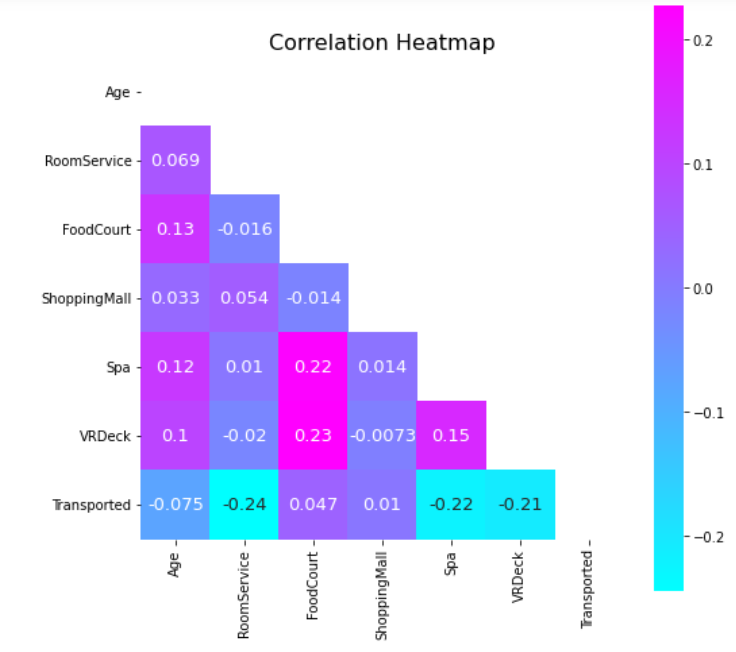
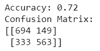

# DS_finalProject

# Introduction
The objective of this project is to use a dataset to explore creating a machine learning method in python. As someone who is very interested in machine learning, I'm excited to learn more about how to implement a model in python. For this project, I used a dataset from Kaggle describing a spaceship based on the Titanic, on which passengers are being randomly transported to an alternate universe. My goal is to answer the following research questions:
1. Are any of the features correlated?
2. Which of the features are most indicative of whether a passenger will be transported or not?
3. Can we predict if a passenger will be transported based on the feature variables using logistic regression?
4. How well did the model perform?

# Selection of Data
The dataset has 14 columns summarized in the table below:
| **Column**        | **Meaning**                                      |
|---------------|------------------------------------------------------|
| PassengerID   | Unique ID for each passenger on the ship             |
| HomePlanet    | Planet each passenger departed from                  |
| CryoSleep     | Binary indicator if passengers were in cryosleep     |
| Cabin         | Cabin number of each passenger (deck/num/side: P/S)  |
| Destination   | Passenger’s destination                              |
| Age           | Age of each passenger                                |
| VIP           | Indicator if passenger paid for VIP service          |
| RoomService   | Amount the passenger was billed for room service     |
| FoodCourt     | Amount the passenger was billed at the food court    |
| ShoppingMall  | Amount the passenger was billed at the shopping mall |
| Spa           | Amount the passenger was billed at the spa           |
| VRDeck        | Amount the passenger was billed on the VR Deck       |
| Name          | First and last name of passenger                     |
| Transported   | Indicator of whether a passenger was transported     |

A preview of the data can be seen below.

The dataset has 8693 rows. Unfortunately, the dataset is missing some values that must be dealt with, which are summarized in the table below:

| **Feature**       | **# NA’s** |
|---------------|--------|
| PassengerID   | 0      |
| HomePlanet    | 201    |
| CryoSleep     | 217    |
| Cabin         | 199    |
| Destination   | 182    |
| Age           | 179    |
| VIP           | 203    |
| RoomService   | 181    |
| FoodCourt     | 183    |
| ShoppingMall  | 208    |
| Spa           | 183    |
| VRDeck        | 188    |
| Name          | 200    |
| Transported   | 0      |

Due to each column missing a relatively small amount of values, I decided to impute missing numerical values with the median and missing categorical values with the mode. With no more missing values, the dataset is ready to be explored and evaluated. 

# Methods

For my methods, I used: 
- Pandas to import the dataset and built in python functions to examine its shape and summary statistics
- NumPy commands for general data analysis
- Matplotlib and Seaborn for building visualizations to provide insights to the data
- SciKit-learn for imputing missing values efficiently (SimpleImputer), building the logistic regression model, and evaluating its performance
- Statsmodels to calculate the features' VIF to test for multicollinearity

Inference methods used with SciKit-learn:
- Logistic Regression

Logistic regression is a probabilistic classifer that predicts the probability of an event occuring (in this case, whether a passenger will be transported or not). The output will be bounded between 0 and 1. In logistic regression, we apply a logit transformation on the odds, and beta coefficients are estimated using the maximum likelihood estimation. 

Features: SimpleImputer, RFECV, RFE, cross_validate, train_test_split, accuracy_score, confusion_matrix

I chose logistic regression due to the following reasons:
- predicting a binary variable
- low multicollinearity between independent variables
- data sample size is large

#Results

From the correlation heat map below, I can see that none of my variables were strongly correlated. This is ideal for a logistic regression model.

Furthermore, I can see there is very little multicollinearity among my features.

From the graphs I made examining different distributions and categorical variables, I decided my most important features to predict if a passenger is transported were age, home planet, destination, cabin deck, and cabin side. However, since I am new to this whole process, there are probably more thorough ways to investigate feature importance and these may not truly be the best variables to use for my model. 

My logistic regression model had an accuracy of 72%, which can be seen below as well as the confusion matrix. 

I can see from the confusion matrix 694 passengers were correctly predicted to not be transported and 563 passengers were correctly predicted to be transported.

The feature coefficients can be seen below too.

Overall, I found that using this model and these features, I can create a logistic regression model with an accuracy of 72% to predict if a passenger will be transported. 

#Discussion

#References
